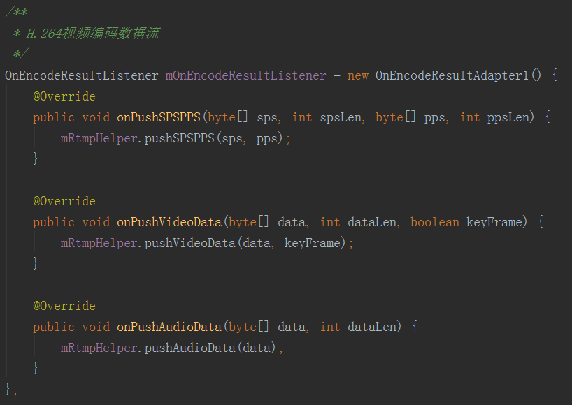

# LQRLibrtmp
基于librtmp搭建的RTMP推流器

## 一、编译

先`Build/Clean Project`清理下工程编译，然后`Rebuild Project`，在`app/build/intermediates/cmake`目录下，可以找到编译好的so库。


java层工具类RtmpHelper 存放在将工程app源码中的`com.lqr.librtmp`包下。


将`com.lqr.librtmp.RtmpHelper`与编译好的so库复制到自己工程对应的lib和src目录下，即可使用。

>注意：RtmpHelper的包名必须是com.lqr.librtmp。

## 二、使用

### 1、初始化RTMP
```java
mRtmpHelper = new RtmpHelper();
mRtmpHelper.initLivePush(RTMP_URL); // 设置rtmp连接
```

### 2、监听连接状态
```java
mRtmpHelper.setOnConnectionListener(new OnConnectionListener() {
    @Override
    public void onConnecting() {
        // 连接中...
    }

    @Override
    public void onConnectSuccess() {
        // 连接中成功...
    }

    @Override
    public void onConnectFail(String msg) {
        // 连接中失败...
    }
});
```

### 3、推送H.264视频流
```java
// 发送关键帧信号（在发送关键帧之前发送）
mRtmpHelper.pushSPSPPS(sps, pps);
// 发送H.264数据（包括：关键帧，普通帧）
mRtmpHelper.pushVideoData(data, keyFrame);
```
### 4、推送AAC音频流
```java
mRtmpHelper.pushAudioData(data);
```

### 5、销毁推流器
```java
if (mRtmpHelper != null) {
    mRtmpHelper.stop();
    mRtmpHelper = null;
}
```

H.264视频编码与AAC音频编码，需要自己另行处理，与本库无关。

